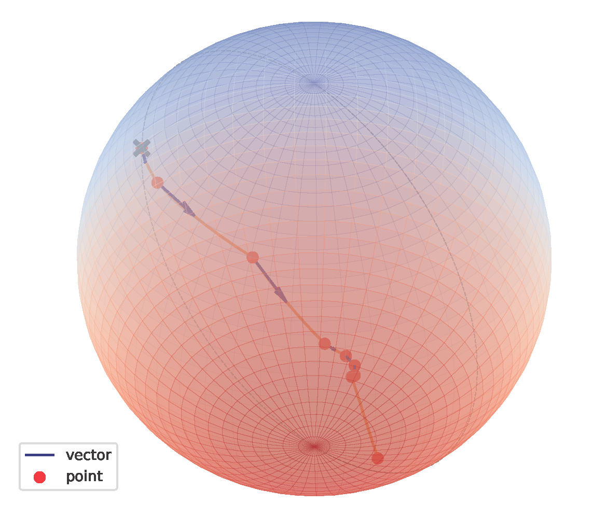

# Spiking Graph Neural Networks on Riemannian Manifolds

## Get Started

```shell
python main.py --task NC --dataset Physics --root_path your_path
```

## Visualization

<div align=center>

</div>
<div align=center>
Figure 1. Visualization of 1-th node on KarateClub dataset.
</div>
<br><br>
<div align=center>

</div>
<div align=center>
Figure 2. Visualization of 17-th node on KarateClub dataset.
</div>