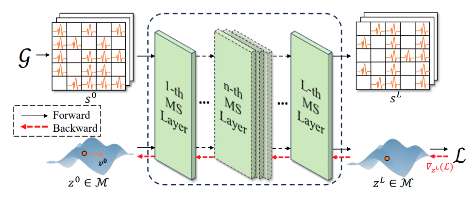

# [NeurIPS 2024] Spiking Graph Neural Networks on Riemannian Manifolds

## Get Started

Install Python packages.
```shell
pip install -r requirements.txt
```
Then you can run the command to train the model.
```shell
python main.py --task NC --dataset Physics --root_path ${your_path}
```

please replace ```${your_path}``` with your dataset file path.
If you want to use vallina SNN neurons, you can add ```--use_MS```. 

If you need to use product space of manifolds, you can add ```--use_product```.

All the configuration of models can be load from Json file in ```./configs```.

## Model Architecture

<div align=center>

</div>

<div align=center>

</div>

## Results
<div align=center>

</div>

## Visualization
<div align=center>

</div>
<div align=center>
Figure 1. Visualization of 34-th node on KarateClub dataset on Torus manifold.
</div>
<br><br>
<div align=center>

</div>
<div align=center>
Figure 2. Visualization of 1-th node on KarateClub dataset on Sphere manifold.
</div>
<br><br>
<div align=center>

</div>
<div align=center>
Figure 3. Visualization of 17-th node on KarateClub dataset on Sphere manifold.
</div>